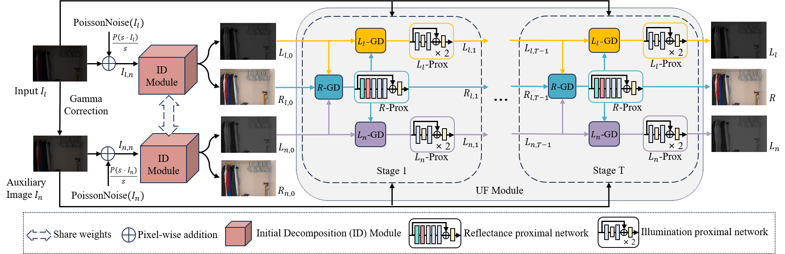

## [S2UNet]  Low-Light Image Enhancement

## Overview


## 🏃 Getting Started

### 📦 Dependencies and Installation

* Python 3.8.20
* Pytorch 2.4.1

We advise you to install Python and PyTorch with Anaconda:

(1) Create Conda Environment

```
conda create --name py38 python=3.8.20
conda activate py38
```

(2) Install Dependencies

```
cd S2UNet
pip install -r requirements.txt
```

## Testing

Prepare the low-light images you want to test and place them in a folder. Then run:

```
python test.py \
    --test_lowlight_dir /your_test_images \
    --save_dir ./result_test
```

```
# test_lowlight_dir: The path of your test image folder.
# save_dir: The enhanced results will be saved to this folder.
```

## Evaluation

To evaluate PSNR, SSIM, NIQE, PI, and BRISQUE metrics, run:

```
python evaluate.py \
    --test_dir ./result_test \
    --test_gt_dir /gt_images
```

```
# test_dir: Path to the folder containing enhanced images.
# test_gt_dir: Path to the folder containing ground truth images (optional).
```

* The script will compute full-reference metrics (PSNR, SSIM) if ground truth images are provided; otherwise, it will compute no-reference metrics (NIQE, PI, BRISQUE).

To evaluate LOE metric, run:

```
python eval_loe.py \
    --test_original_dir /your_test_images \
    --test_processed_dir ./result_test
```

```
# test_original_dir: Path to the folder containing low-light images.
# test_processed_dir: Path to the folder containing enhanced images.
```

## 🤝 Acknowledgements

We sincerely thank the authors of related open-source projects and the providers of the public datasets used in this work.


